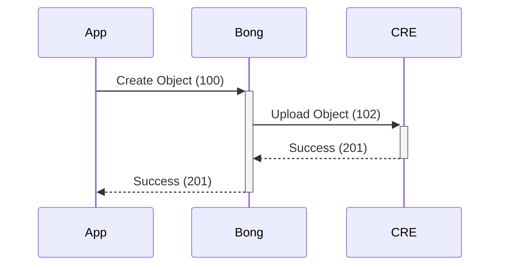

# Basic Object Normalization Gateway

Interfaces with multiple Cannabis APIs (BioTrack, CCRS, Metrc).
Normalizes to the OpenTHC API interfaces and data-models.




## Install

1. Clone this Repository to somewhere clever `git clone $REPO /opt/openthc/bong`
1. Update the Apache Config (use `etc/apache2-example.conf` as a template)
1. Create the Base Database from `etc/sql/*.sql` and add the triggers.
1. Configure in `etc/config.php` from `etc/config-example.php`


## Connect

You can use BONG through it's normal web-interface to view objects in real time or view logs.

BONG also provides an API -- so that other services can consume the data from the different back-ends easier.


### With JWT

```
curl --header "Bearer: jwt/$JWT" $BONG/auth/open
```


### With Session

```php
curl --cookie=cookie-file.dat $BONG/auth/open
```


## Sync & Cache

The APIs that BONG interfaces with don't all agree on how to do pages of data, or sorting, or filtering.
BONG has tools that work in the background to pull and cache data.

```
GET $BONG/status
GET $BONG/inventory/status
```


## Reading Objects

A low level, GET and POST/PUT interface exists.


```
GET https://$BONG/license
GET https://$BONG/license/current/status
GET https://$BONG/license/$ID/status
```


## Reading Crop

```
GET /crop
GET /crop?filter=(active|wet-collect|dry-collect|done|dead)
GET /crop?filter=and&f-[n0]=[v0]&f-[n1]=[v1]
GET /crop?filter=or&f-[n0]=[v0]&f-[n1]=[v1]
```

## Reading Inventory

```
GET /inventory
GET /inventory?filter=(active)
GET /inventory?filter=and
GET /inventory?filter=or
```

## Reading Transfer Data

```
GET /b2b
GET /b2b/outgoing?filter=(active)
GET /b2b/incoming?filter=(active)
GET /b2b?filter=and
GET /b2b?filter=or
```
