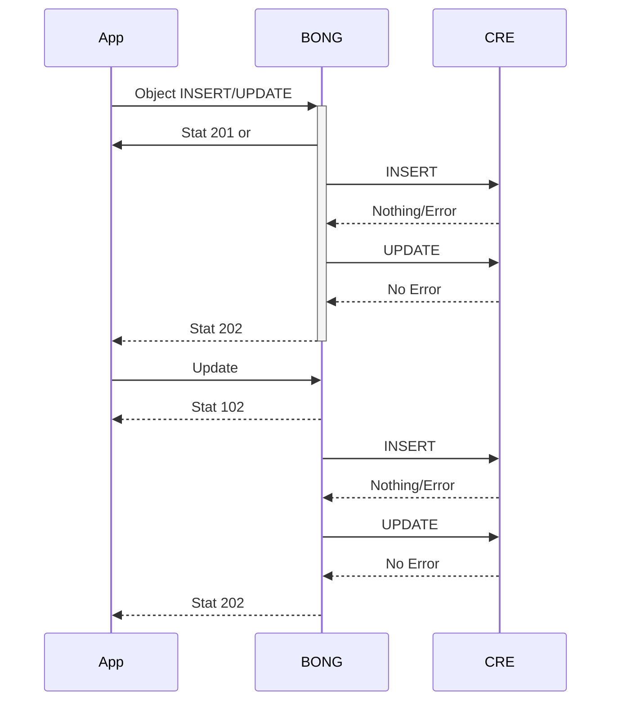

# CCRS Diagrams

How CCRS Works, in Diagrams

```mermaid
sequenceDiagram
    App->>+BONG: Object INSERT/UPDATE
    BONG->>App: Stat 201 or 
    BONG->>CRE: INSERT
    CRE-->>BONG: Nothing/Error
    BONG->>CRE: UPDATE
    CRE-->>BONG: No Error
    BONG-->>-App: Stat 202
    App->>BONG: Update
    BONG-->>App: Stat 102
    BONG->>CRE: INSERT
    CRE-->>BONG: Nothing/Error
    BONG->>CRE: UPDATE
    CRE-->>BONG: No Error
    BONG-->>App: Stat 202
```
